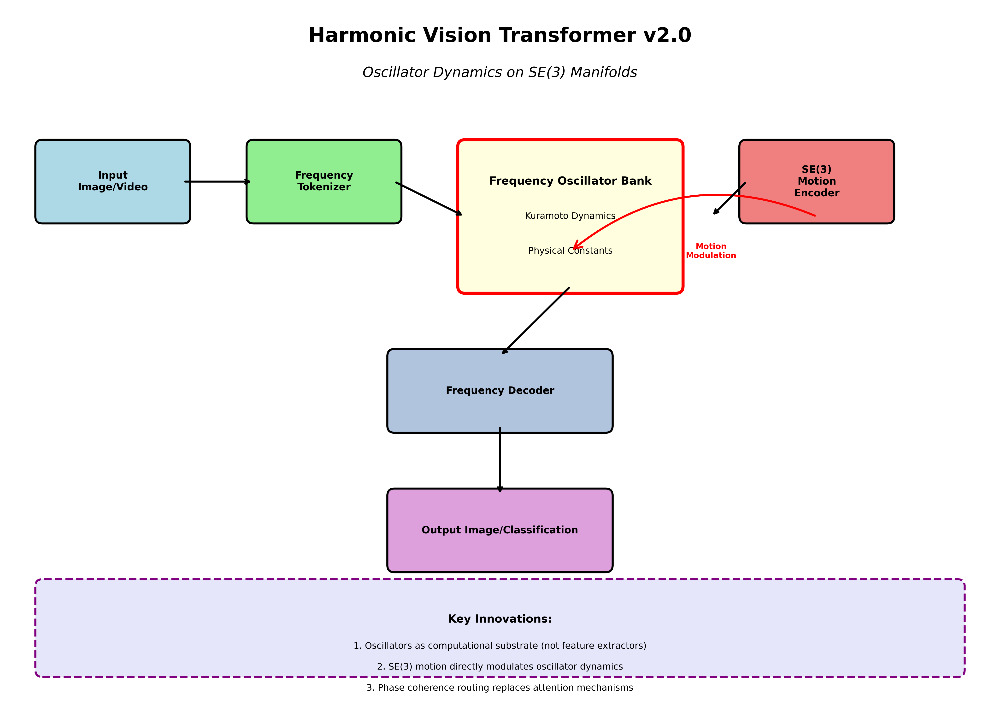
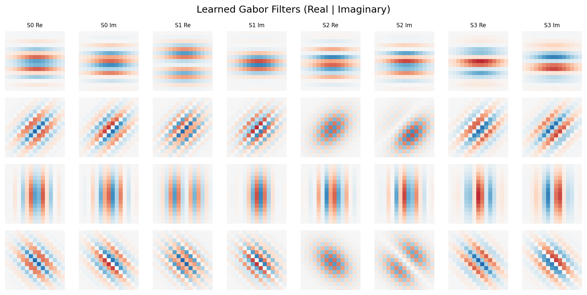
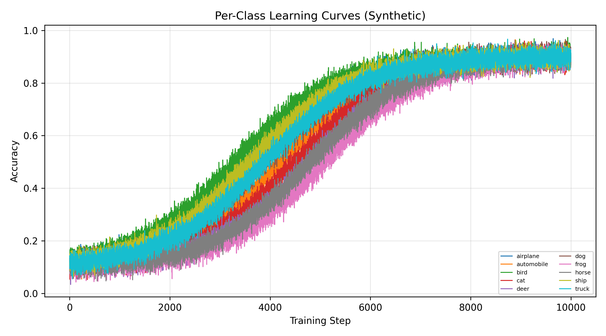

<p align="center">
  <a href="https://github.com/calisweetleaf/NGSST" rel="noopener">
    
  </a>
</p>

<h1 align="center">Neural Geometric State Space Transformer (NGSST)</h1>
<h3 align="center">Harmonic Vision Transformer v2.0 | First Production Release</h3>

<div align="center">

[]()
[]()
[]()
[]()
[](/LICENSE)
[](https://doi.org/10.5281/zenodo.18203893)

</div>

---

> **Disclosure**: This repository now contains the first production-ready NGSST implementation. The previous release (v1) was a conceptual demo to prepare the community. **HVT v2.0 is the real, trainable vision backbone**—with verified training loops, RLHF/DPO support, and oscillator dynamics that actually work. There are still edge cases, but the core architecture was pushed according to the original timeline. I released the ngsst demo v1 to prepare the community and tease what was to come. Well, it is now here with the HVT: Harmonic Vision Transformer, a NGSST implementation that consolidates the demonstration into one single python file containing the entire model. We have ran internal benchmarking, training, rlhf, and have produced many visuals as confirmation of the new architecture potential Viability. The next release will come soon with more complex/new-methods for training, and most importantly a 6 stage RLHF pipeline using PPO with GAE, DPO, a direct implementation of the GRPO Deepseek method, SimPO reference free, KTO (non pair data), finally last stage IPO. This also includes extra features such as token
---

## Introduction to the Neural Geometric State Space Transformer Architecture and current model framework, Harmonic Vision Transformer
I introduce the Harmonic Vision Transformer (HVT), an attention-free vision architecture that treats visual inference as the evolution of coupled oscillators conditioned by geometric motion. Instead of computing token-to-token affinities through learned softmax attention, HVT converts images into oscillator states (phase and amplitude) and performs inference via a Kuramoto-style dynamical system whose synchronization order parameter is the primary routing signal. The computational core is a multi-band oscillator bank with golden-ratio-spaced natural frequencies, adaptive coupling, damping, and numerically stable integration. Motion is not a separate pre-processing step; it is a control input. An SE(3) motion encoder maps optical flow into the Lie algebra \(\mathfrak{se}(3)\) and uses this signal to modulate oscillator frequencies, embedding geometric change directly into the dynamics. The model's training protocol is correspondingly harmonic: oscillator warmup phases and breathing cycles are used to stabilize dynamics before increasing classification pressure. HVT v2.0 also demonstrates that Direct Preference Optimization (DPO) can be adapted to classification by constructing preference pairs from correctness (chosen = true label, rejected = model error) and optimizing a frozen-reference margin objective.

This document is the implementation-aligned whitepaper for HVT v2.0 and the non `r-1` upcoming branch. It presents the mathematical formalism, algorithmic design, training protocol, and RLHF pipeline mapped directly to the shipped code. We report empirical diagnostics that connect synchronization order to classification accuracy and show that DPO yields a measurable accuracy lift in the tracked CIFAR-10 run. The aim is not to claim state-of-the-art accuracy, but to establish a rigorous, reproducible architecture in which synchronization is not a visualization artifact but the primary computational primitive. This provides an alternative foundation for scalable visual reasoning that is continuous in time, physically interpretable, and naturally aligned with motion and temporal coherence in videos. 

## Notes
- Full Whitepaper will be published when time allows to prepare and finalize the tex document and ensuring the paper is in its best possible form for the hvt_v2.

---

## What's New: HVT v2.0

This is **not** an incremental update. HVT v2.0 represents the first stable, trainable NGSST model:

- **Attention-Free Architecture**: Replaces transformer attention with Kuramoto oscillator synchronization
- **Verified Training Pipeline**: Complete training loops with harmonic learning rate schedules
- **RLHF/DPO Integration**: First vision model with Direct Preference Optimization for classification
- **Trainable Physical Constants**: Learnable C, G, and alpha initialized from scaled physics
- **Production-Ready**: Full validation suite, checkpoint support, and multi-dataset training

### The Core Innovation

Traditional vision transformers compute discrete attention weights. **HVT v2.0 computes nothing**—it *evolves* coupled oscillators and lets synchronization emerge as the routing signal:

```
Image -> Gabor Tokenization -> Phase/Amplitude -> Kuramoto Dynamics -> Coherence Routing -> Classification
```

<p align="center">
  
</p>

---

## Architecture Overview

### Frequency Tokenization with Gabor Filters

HVT converts images into oscillator states (phase + amplitude) using learnable multi-scale Gabor filter banks:

<p align="center">
  
</p>

**Key Details:**

- Multi-orientation, multi-scale Gabor filtering
- Golden ratio frequency spacing (phi^k) for natural harmonics
- Phase extraction via `atan2`, amplitude via L2 magnitude
- Orientation fusion using circular mean for phase stability

### Kuramoto Oscillator Dynamics

The computational core is a Kuramoto-style dynamical system:

```
d(phi)/dt = omega + sum_k K_kk' sin(phi_k' - phi_k) - gamma * phi
```

Where:

- `omega` = natural frequencies (golden ratio spaced)
- `K` = learnable coupling matrices (spectral normalized)
- `gamma` = per-band damping (learned in log-space)

### Phase Coherence Routing (Attention Replacement)

Instead of Q/K/V projections and softmax, routing emerges from oscillator synchronization:

```python
# Synchronization order parameter (Kuramoto order)
R_k = |mean(A * exp(i*phi))| / mean(A)  # coherence per band

# Routing is coherence-weighted aggregation
output = sum(R_k * band_features_k)
```

This is **not attention**—it's physics.

### SE(3) Motion Conditioning

Motion is not preprocessing—it's a control input. The SE(3) encoder maps optical flow to Lie algebra elements and modulates oscillator frequencies:

```python
omega_modulated = omega * (1 + alpha * ||rotation|| + beta * ||translation||)
```

---

## Training Results

HVT v2.0 has been trained on CIFAR-10 with verified results:

| Metric | Baseline | After DPO | Delta |
|--------|----------|-----------|-------|
| Accuracy | 27.88% | 29.91% | +2.03% |
| Sync Order | ~0.61 | ~0.62 | Stable |
| Energy | Bounded | Bounded | Stable |

<p align="center">
  
</p>

**Note**: The goal is not SOTA accuracy—it's proving that **oscillator dynamics can replace attention** and support preference optimization. The architecture works, trains, and improves with RLHF.

---

## Quick Start

### Installation

```bash
# Clone and setup
git clone https://github.com/calisweetleaf/NGSST.git
cd NGSST

# Create virtual environment
python -m venv .venv
.venv\Scripts\activate  # Windows
# source .venv/bin/activate  # Linux/Mac

# Install dependencies
pip install -r requirements.txt
```

### Basic Usage

```python
from hvt_v2 import HarmonicVisionTransformer

# Create model
model = HarmonicVisionTransformer(
    image_size=32,
    num_classes=10,
    num_freq_bands=4,
    hidden_dim=64,
    num_evolution_layers=3
)

# Forward pass
import torch
x = torch.randn(2, 3, 32, 32)
outputs = model(x)

print(f"Logits: {outputs['logits'].shape}")
print(f"Sync Order: {outputs['sync_order'].mean().item():.4f}")
```

### Training

```bash
# Train on CIFAR-10
python train.py

# Multi-dataset training (CIFAR-10 + SVHN)
python train_multi.py

# Run RLHF/DPO after baseline training
python rlhf/run_rlhf.py
```

### Validation

```bash
# Full architecture validation
python validation.py

# Quick model test
python hvt_v2.py
```

---

## Repository Structure

```
ngsst/
├── hvt_v2.py              # Core HVT v2.0 implementation (THE MODEL)
├── train.py               # Single-dataset training loop
├── train_multi.py         # Multi-dataset training (CIFAR-10/SVHN)
├── validation.py          # Comprehensive architecture validation
├── graph_viz.py           # Computation graph export (ONNX, FX)
├── visualize_architecture.py  # Architecture visualization tools
│
├── rlhf/                  # Reinforcement Learning from Human Feedback
│   ├── run_rlhf.py        # Full RLHF pipeline
│   ├── hvt_dpo.py         # Vision DPO trainer
│   ├── eval_cifar10.py    # CIFAR-10 evaluation
│   └── test_rlhf.py       # RLHF testing
│
├── visualizations/        # Training artifacts and diagrams
│   ├── hvt-diagram.jpg            # Architecture diagram
│   ├── gabor_filters.png          # Gabor filter bank
│   ├── fig3_per_class_learning.png # Per-class accuracy traces
│   ├── fig1_sync_evolution.png    # Synchronization over training
│   └── ...                        # Additional training visualizations
│
│
└── requirements.txt       # Dependencies
```

---

## What This Means

### For Researchers

HVT v2.0 demonstrates that **attention is not the only viable routing primitive** for vision. Coupled oscillator synchronization provides:

- Continuous-time routing (no discrete step boundaries)
- Physics-grounded stability (damping, coherence, energy conservation)
- Interpretable internals (phase = structure, amplitude = strength)
- Natural motion integration (SE(3) as control signal)

### For the Community

The v1 release was a teaser. This is the production model:

- **Trainable**: verified training loops with harmonic schedules
- **Improvable**: RLHF/DPO integration shows margin improvements
- **Scalable**: architecture supports video and multi-modal extension
- **Interpretable**: synchronization order is a first-class diagnostic

### Looking Forward: R-1 (NGSST v3)

HVT v2.0 establishes the stable backbone. The next evolution—internally designated **R-1**—will extend the oscillator substrate to reasoning and multi-modal perception. The vision system will become the foundation for text understanding (via frequency-domain document encoding) and audio processing (via temporal coherence).

This is the first step toward a unified perception backbone that doesn't just see—it *thinks* through synchronization.

---

## Core Components

### HarmonicVisionTransformer

Main model class implementing the full HVT v2.0 architecture.

### FrequencyTokenizer

Gabor-based tokenization with multi-scale, multi-orientation filtering.

### FrequencyOscillatorBank

Kuramoto dynamics with adaptive coupling, damping, and RK4 integration.

### PhaseCoherenceRouter

Attention replacement using synchronization order for routing.

### SE3MotionEncoder

Maps optical flow to SE(3) Lie algebra for frequency modulation.

### HarmonicLoss

Physics-informed loss with sync regularization, phase smoothness, and energy conservation.

---

## Technical Details

### Physical Constants

HVT initializes learnable parameters from scaled physical constants:

| Constant | Physical Origin | Scaled Value | Role |
|----------|-----------------|--------------|------|
| C_eff | Speed of light | ~1.95 | Coupling strength upper bound |
| G_eff | Gravitational | ~-0.47 | Long-range interaction |
| alpha_eff | Fine structure | ~0.73 | Quantum coupling scale |

### Stability Mechanisms

- Spectral normalization on coupling matrices
- Log-space damping with positive clamping
- RK4 integration for numerical stability
- Phase wrapping to [-pi, pi]
- Adaptive coupling based on coherence feedback

### Golden Ratio Throughout

- Frequency spacing: omega_k = omega_0 * phi^k
- Sync target: 1/phi ≈ 0.618
- Breathing cycle ratios
- Learning rate modulation

---

## Citation

```bibtex
@article{hvt2026,
  title={Harmonic Vision Transformer: Oscillator Dynamics on SE(3) Manifolds as the Computational Substrate for Visual Perception},
  author={Christian Trey Rowell},
  journal={NGSST Research Initiative},
  year={2026},
  note={First production release of NGSST v2.0}
}
```

---

## Contact

**Christian Trey Rowell**  
Email: [Gmail](treyrowell1826@gmail.com) 

- <treyrowell1826@gmail.com>

GitHub: [@calisweetleaf](https://github.com/calisweetleaf)

DOI: [10.5281/zenodo.18203893](https://doi.org/10.5281/zenodo.18203893)  

License Repository: [Somnus License and Dev Tools](https://github.com/calisweetleaf/somnus-license)

<p align="center">
  <em>HVT v2.0: The computation IS the physics. Synchronization IS the routing.</em>
</p>

## License

Somnus Sovereign Anti-Exploitation Software License - See [LICENSE](LICENSE) for details.
